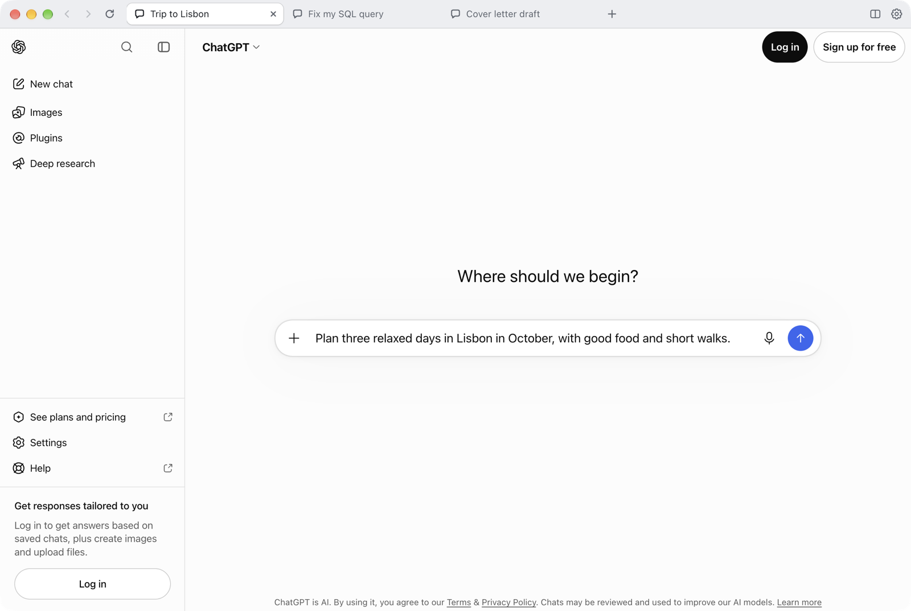
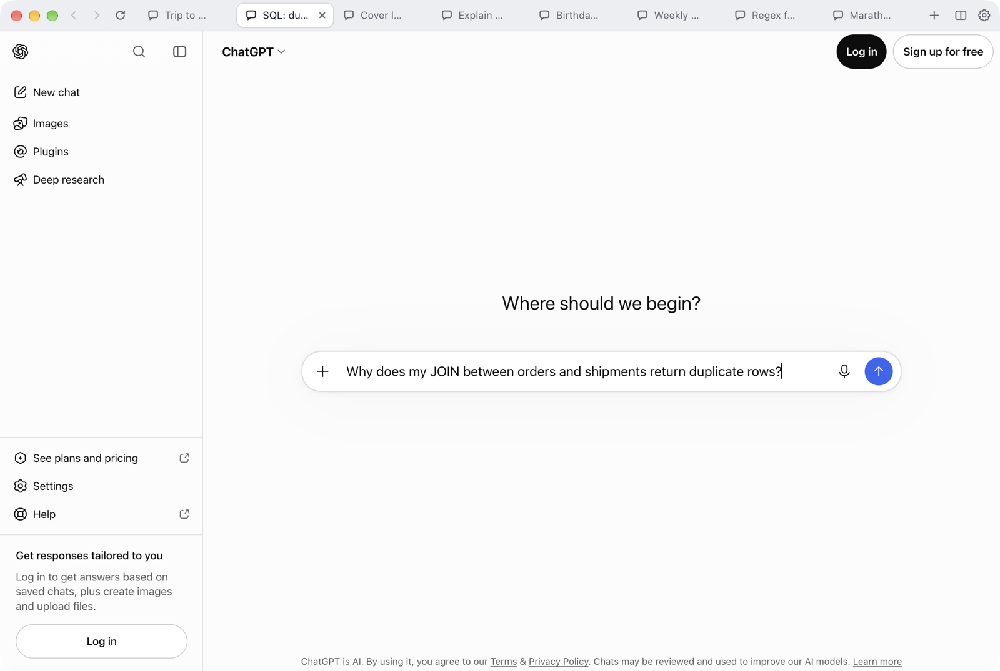
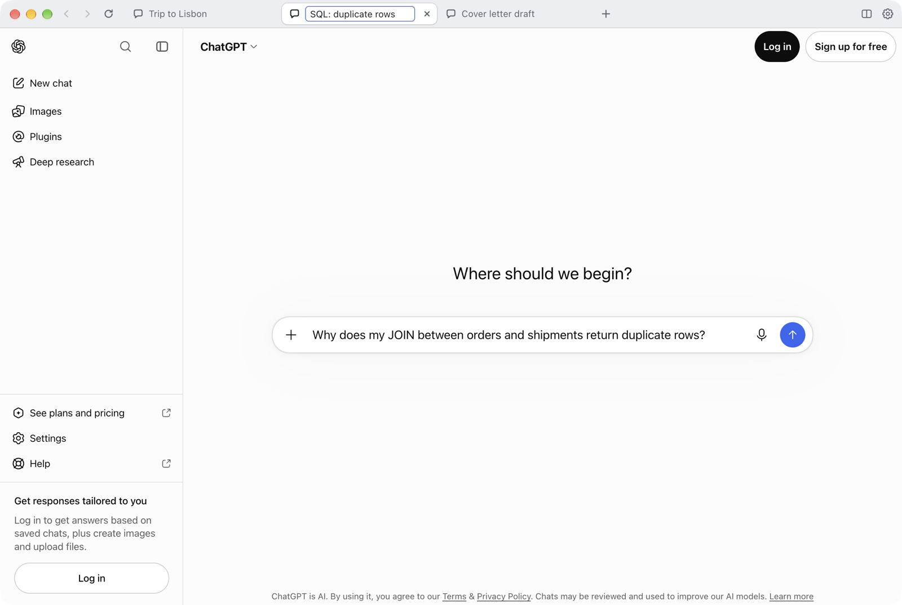
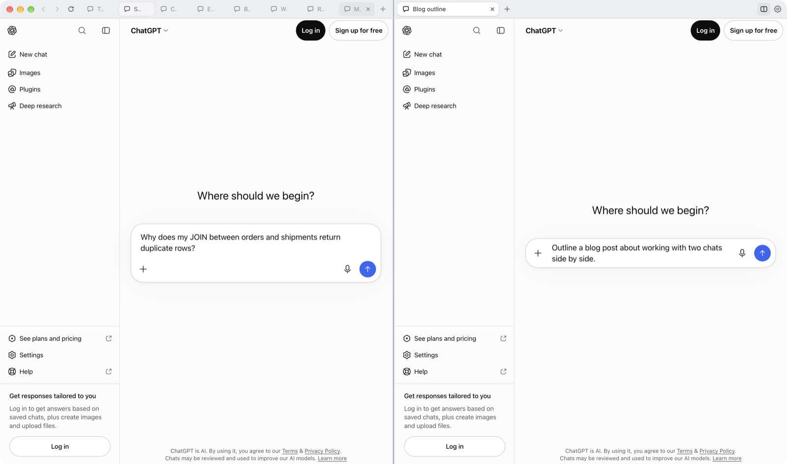
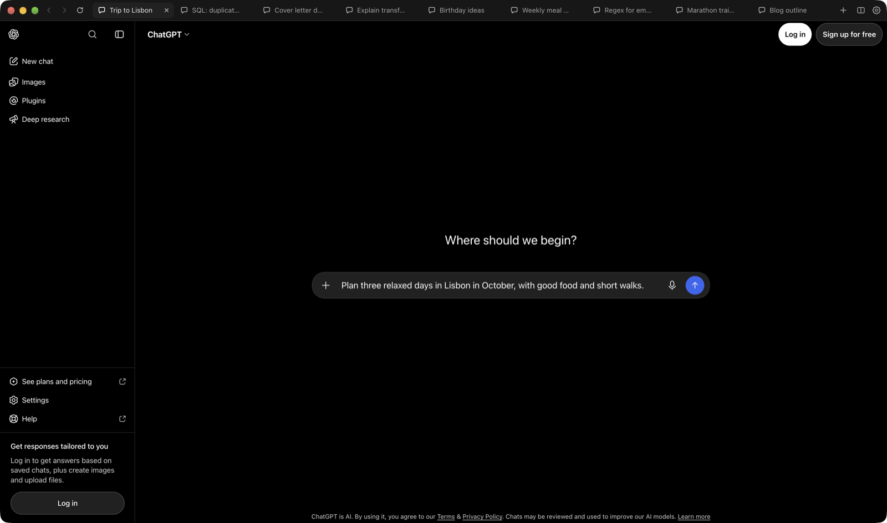
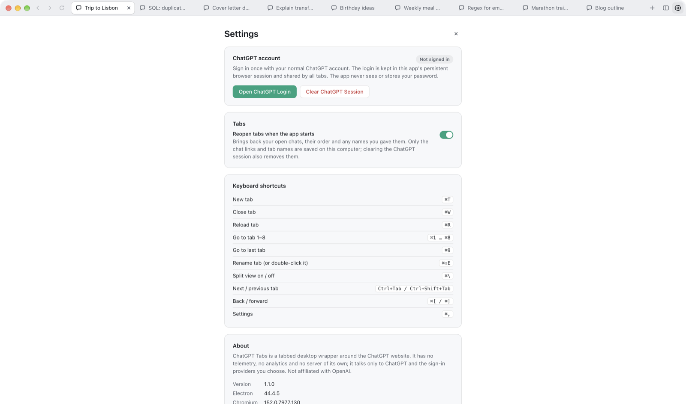

# ChatGPT Tabs

A **Chrome-style tabbed** desktop client for the ChatGPT web app (Electron + TypeScript).



- Every tab is its own `WebContentsView` (own renderer process, own navigation history, own conversation).
- All tabs share **one persistent session** (`persist:chatgpt`): sign in once and every tab, and every future launch, stays signed in.
- **Name your tabs** (double-click a tab) and **pick up where you left off**: tabs, names and order come back on the next launch.
- **Split view**: two columns side by side, each with its own tabs, via the two-column button in the top-right corner (or `⌘\` / `Ctrl+\`).
- Not a general-purpose browser: no address bar, bookmarks or history manager. Links outside ChatGPT open in the system browser.
- Not an OpenAI API client; no API key needed. It uses your existing ChatGPT web account.
- **No** telemetry, analytics, backend server or auto-update.

> ChatGPT Tabs is an independent wrapper and is not affiliated with OpenAI.

---

## Download

**➡️ [Download the latest release](https://github.com/AvvaMobile/ChatGPT.Tabbed/releases/latest)** · [Website](https://avvamobile.github.io/ChatGPT.Tabbed/)

| Platform | File | Notes |
| --- | --- | --- |
| macOS – Apple Silicon (M1/M2/M3/M4) | `ChatGPT-Tabs-<version>-mac-arm64.dmg` | macOS 12 Monterey or newer |
| macOS – Intel | `ChatGPT-Tabs-<version>-mac-x64.dmg` | macOS 12 Monterey or newer |
| Windows 10/11 (installer) | `ChatGPT-Tabs-<version>-win-x64-setup.exe` | Installs per user, no admin rights needed; adds Start menu + desktop shortcut |
| Windows 10/11 (portable) | `ChatGPT-Tabs-<version>-win-x64-portable.zip` | No installation: unzip and run `ChatGPT Tabs.exe` |
| Checksums | `SHA256SUMS.txt` | SHA-256 of every file above |

Not sure which Mac you have?  → Apple menu → **About This Mac**: "Chip: Apple M…" = Apple Silicon, "Processor: Intel" = Intel.
Windows on ARM devices can use the x64 build (it runs under Windows' built-in emulation).

### Verify your download (recommended)

macOS downloads are signed with a Developer ID and notarized by Apple; the Windows build is not code-signed yet. Checking the SHA-256 hash against `SHA256SUMS.txt` from the same release confirms the file was not tampered with:

```bash
# macOS
shasum -a 256 ~/Downloads/ChatGPT-Tabs-*-mac-arm64.dmg
```

```powershell
# Windows (PowerShell)
Get-FileHash $env:USERPROFILE\Downloads\ChatGPT-Tabs-*-win-x64-setup.exe -Algorithm SHA256
```

The printed hash must match the line for that file in `SHA256SUMS.txt`. Only download from this repository's Releases page.

### Install on macOS

1. Open the `.dmg` and drag **ChatGPT Tabs** into **Applications**.
2. Open it from Applications or Launchpad. The app is signed with a Developer ID and notarized by Apple, so macOS only shows its standard "downloaded from the internet" confirmation on the first launch.
3. Microphone/camera access for voice chat is requested by macOS on first use.

You can check the signature yourself: `spctl --assess --verbose "/Applications/ChatGPT Tabs.app"` should report `source=Notarized Developer ID`.

### Install on Windows

- **Installer:** run `…-setup.exe`. Windows SmartScreen may show "Windows protected your PC" because the file is not code-signed: click **More info → Run anyway**. You can choose the install folder; the app is installed for the current user only. Uninstall via **Settings → Apps**. Your ChatGPT login (in `%APPDATA%\ChatGPT Tabs`) is kept on uninstall; use *Clear ChatGPT Session* first if you want it removed.
- **Portable:** unzip `…-portable.zip` anywhere and run `ChatGPT Tabs.exe` (SmartScreen may ask once as well).

---

## Screenshots

| Many chats side by side | Renaming a tab |
| --- | --- |
|  |  |
| **Split view** | **Dark mode** |
|  |  |
| **Settings** | |
|  | |

The screenshots are taken from the real app by `node scripts/capture-screenshots.mjs` (macOS, after packaging). It uses a throw-away profile and no account; prompts are typed into the composer but never sent.

## Contents

1. [Download](#download)
2. [Build from source](#build-from-source)
3. [Publishing a release](#publishing-a-release)
4. [First ChatGPT login](#first-chatgpt-login)
5. [Clearing the session](#clearing-the-session)
6. [Tab names and restoring tabs](#tab-names-and-restoring-tabs)
7. [Keyboard shortcuts](#keyboard-shortcuts)
8. [Security model](#security-model)
9. [Privacy](#privacy)
10. [Architecture](#architecture)
11. [Tests](#tests)
12. [Known limitations](#known-limitations)
13. [Troubleshooting](#troubleshooting)

---

## Build from source

Anyone can build their own copy; the result is identical in behaviour to the release downloads.

**Requirements**

- Node.js 20 or newer (the project pins 24 in `.nvmrc`) and npm
- Git
- macOS builds must run on macOS; the Windows installer must be built on Windows (the NSIS tool electron-builder uses is not available for Apple Silicon Macs)
- No global Electron install: Electron is a project `devDependency`

**Get the code and run it**

```bash
git clone https://github.com/AvvaMobile/ChatGPT.Tabbed.git
cd ChatGPT.Tabbed
npm ci             # exact dependency versions from package-lock.json (+ Electron binary)
npm run dev        # development mode, UI hot reload
```

**Build installable packages**

| On | Command | Output in `release/` |
| --- | --- | --- |
| macOS | `npm run package` | `ChatGPT-Tabs-<version>-mac-arm64.dmg`, `ChatGPT-Tabs-<version>-mac-x64.dmg`, plus the unpacked apps in `mac-arm64/` and `mac/` |
| Windows | `npm run package:win` | `ChatGPT-Tabs-<version>-win-x64-setup.exe`, `ChatGPT-Tabs-<version>-win-x64-portable.zip`, plus `win-unpacked\ChatGPT Tabs.exe` |
| Linux | `npm run package:linux` | `ChatGPT-Tabs-<version>-linux-x64.AppImage` (not part of official releases) |

Then run the automatic smoke test against the packaged app (`npm run smoke:package`) or just open it:

```bash
open "release/mac-arm64/ChatGPT Tabs.app"      # macOS (Apple Silicon)
```

```powershell
& "release\win-unpacked\ChatGPT Tabs.exe"      # Windows
```

`npm run package` produces **ad-hoc signed** Mac apps: they open directly on the machine that built them, but other Macs will block them. For distribution use the signed build below. Windows builds are unsigned; an Authenticode certificate can be configured via the standard electron-builder `CSC_*` / `WIN_CSC_*` environment variables.

### Signed and notarized macOS build

Requires an Apple Developer account with a **Developer ID Application** certificate in the login keychain and an **App Store Connect API key** (`.p8`).

1. Put the key file in `~/.appstoreconnect/private_keys/AuthKey_<KEY_ID>.p8`.
2. Create `.env.signing.local` in the project root (it is git-ignored and must never be committed):
   ```
   APPLE_API_KEY_ID=<key id>
   APPLE_API_ISSUER=<issuer id>
   # optional: MAC_SIGNING_IDENTITY="Developer ID Application: Your Company (TEAMID)"
   ```
3. Run `npm run package:mac:signed`. It builds the Apple Silicon and Intel DMGs with the hardened runtime, signs them, notarizes and staples both the apps and the DMGs, and verifies the result with `codesign`, `spctl` and `stapler`.

The certificate never leaves the keychain and the API key never leaves the machine; nothing is stored in the repository or in CI.

### Scripts

| Script | What it does |
| --- | --- |
| `npm run dev` | electron-vite dev server + Electron, hot reload for the UI |
| `npm start` | Runs the compiled `out/` folder with Electron (preview) |
| `npm run build` | Typecheck + production build (`out/main`, `out/preload`, `out/renderer`) |
| `npm run typecheck` | `tsc --noEmit` for main/preload, renderer and test code |
| `npm run lint` | ESLint (typescript-eslint + react-hooks) |
| `npm test` | Unit tests (Vitest) + Electron E2E tests (Playwright) |
| `npm run test:unit` | Unit tests only |
| `npm run test:e2e` | Build + Playwright tests against the real Electron app |
| `npm run package` | macOS `.dmg` for Apple Silicon and Intel (ad-hoc signed) |
| `npm run package:mac:signed` | Developer ID signed + notarized macOS `.dmg`s (needs local signing setup) |
| `npm run release:mac -- vX.Y.Z` | Uploads the signed DMGs to the GitHub release `vX.Y.Z` |
| `npm run package:win` | Windows installer + portable `.zip` (run on Windows) |
| `npm run package:linux` | Linux AppImage (run on Linux) |
| `npm run smoke:package` | Launches the packaged app for the current OS with an isolated profile and smoke-tests it |
| `npm run verify` | lint → typecheck → test → package (macOS) → smoke:package |

## Publishing a release

Releases are built by GitHub Actions on real macOS and Windows machines, so nobody has to build installers by hand.

- `.github/workflows/ci.yml` runs lint, typecheck, unit and E2E tests on macOS and Windows for every push and pull request.
- `.github/workflows/release.yml` builds and smoke-tests the packages on both systems and publishes them.
- `.github/workflows/pages.yml` publishes the one-page website in `site/` to GitHub Pages whenever it changes.

Steps for a maintainer:

1. Bump `"version"` in `package.json` (e.g. `1.1.0`) and commit.
2. Tag and push:
   ```bash
   git tag v1.1.0
   git push origin master --tags
   ```
3. Wait for the **Release** workflow (Actions tab). It creates a **draft** release for the tag containing both `.dmg` files, the Windows installer, the portable `.zip` and `SHA256SUMS.txt`, with auto-generated release notes.
4. Replace the CI-built (ad-hoc signed) Mac files with signed and notarized ones, from a Mac that has the signing setup described in [Signed and notarized macOS build](#signed-and-notarized-macos-build):
   ```bash
   npm run package:mac:signed
   npm run release:mac -- v1.1.0
   ```
   This uploads both DMGs to the draft (replacing the CI ones) and updates their lines in `SHA256SUMS.txt`. The script refuses to upload DMGs that are not notarized.
5. Review the draft on the Releases page and click **Publish release**. The [Download](#download) link above always points to the newest published release.

Running the Release workflow manually (Actions → Release → *Run workflow*) builds the same files as downloadable workflow artifacts without creating a release, which is handy for testing.

## First ChatGPT login

1. Open the app. A ChatGPT tab opens automatically.
2. Click the **⚙ Settings** button at the top right (or press `⌘,` / `Ctrl+,`).
3. Click **Open ChatGPT Login**. A separate sign-in window opens that uses the same persistent session.
4. Sign in **manually, as usual** with email/password, Google, Microsoft or Apple (MFA included). Enterprise SSO flows also work inside the window.
5. Once the sign-in is detected, the window closes itself and the open tabs reload. If you close the window yourself, the tabs reload as well.
6. Settings now shows **Signed in**.

Alternative: the **Log in** button inside any ChatGPT tab signs in to the same session.

After quitting and reopening the app you are not asked to sign in again as long as the ChatGPT session cookie has not expired. The session also survives app updates, because the partition name is fixed (`persist:chatgpt`) and the user data directory is tied to the app name.

Where the session data lives on disk:

| OS | Location |
| --- | --- |
| macOS | `~/Library/Application Support/ChatGPT Tabs/Partitions/chatgpt/` |
| Windows | `%APPDATA%\ChatGPT Tabs\Partitions\chatgpt\` |
| Linux | `~/.config/ChatGPT Tabs/Partitions/chatgpt/` |

## Clearing the session

Settings → **Clear ChatGPT Session** → **Clear Session** in the confirmation dialog.

This deletes **all cookies, cache, localStorage/IndexedDB/service worker data and the HTTP auth cache** of the ChatGPT partition, flushes the cookie store to disk, closes an open login window, forgets the saved tabs and tab names, and sends every tab back to the ChatGPT start page. Result: signed out in all tabs. Your conversations stay in your ChatGPT account; only local data on this computer is removed.

## Tab names and restoring tabs

**Rename a tab:** double-click it, press `⌘⇧E` / `Ctrl+Shift+E`, or right-click it and choose **Rename Tab…**. Press Enter to save or Esc to cancel. The name replaces the page title in the tab bar and stays even when ChatGPT changes the conversation title. Save an empty name (or choose **Reset Tab Name** in the right-click menu) to go back to the page title. The right-click menu also has Reload, Duplicate, Close and Close Other Tabs.

**Pick up where you left off:** when you quit (or close the window), the app remembers your open tabs, their order, their names and which one was active, and reopens them next time. Only the active tab loads right away; the others load the first time you click them, so starting stays fast with many tabs.

**Split view:** click the two-column button next to Settings (or press `⌘\` / `Ctrl+\`) to work in two columns, like two browser windows side by side. Each column has **its own tab strip, its own `+` button and its own active tab**; the top bar splits in half, lined up with the columns. The right column starts with a new chat. Click a tab or click into a page to focus that column: `⌘T`, `⌘W`, `⌘1…9`, Ctrl+Tab and back/forward then act on the focused column. Right-click a tab (or use **Tabs → Move Tab to Other Side**) to move it to the other column. Closing the last tab of a column, or pressing the button again, returns to one column; the right column's tabs are kept and appended to the left. Both columns are restored together with your tabs.

You can turn this off in **Settings → Tabs → Reopen tabs when the app starts**; turning it off also deletes the saved tabs.

What is saved, in `<userData>/tabs.json` (readable only by your user account):

- whether split view was on, which column each tab is in, and which tab each column showed;
- for each tab: the ChatGPT page as `origin + path` (for example `https://chatgpt.com/c/<id>`), its last page title, and your custom name, if any;
- which tab was active.

Query strings, fragments and sign-in/API URLs are never saved, and the file never contains cookies, tokens or message text. The file is validated when it is read, so a damaged or edited file is ignored rather than trusted. **Clear ChatGPT Session** deletes it.

## Keyboard shortcuts

| Action | macOS | Windows / Linux |
| --- | --- | --- |
| New tab | `⌘T` | `Ctrl+T` |
| Close active tab | `⌘W` | `Ctrl+W` |
| Reload active tab | `⌘R` | `Ctrl+R` |
| Reload without cache | `⌘⇧R` | `Ctrl+Shift+R` |
| Go to tab 1–8 | `⌘1` … `⌘8` | `Ctrl+1` … `Ctrl+8` |
| Go to last tab | `⌘9` | `Ctrl+9` |
| Rename active tab | `⌘⇧E` | `Ctrl+Shift+E` |
| Split view on / off | `⌘\` | `Ctrl+\` |
| Next / previous tab | `Ctrl+Tab` / `Ctrl+⇧Tab` | `Ctrl+Tab` / `Ctrl+Shift+Tab` |
| Back / forward | `⌘[` / `⌘]` | `Alt+←` / `Alt+→` |
| Settings | `⌘,` | `Ctrl+,` |
| Zoom | `⌘+` / `⌘-` / `⌘0` | `Ctrl++` / `Ctrl+-` / `Ctrl+0` |
| DevTools for tab | `⌥⌘I` | `Ctrl+Shift+I` |

Shortcuts are application-menu accelerators, so they work whether focus is in the tab bar or on the ChatGPT page. Middle-clicking a tab closes it, double-clicking renames it, right-clicking shows the tab menu. Closing the last tab does not quit the app; a fresh tab opens instead.

---

## Security model

Core assumption: **remote ChatGPT content is untrusted**, the app's own local UI (tab bar/settings) is trusted. There is a clear trust boundary between the two.

### Process and isolation settings

| Component | `sandbox` | `contextIsolation` | `nodeIntegration` | Preload |
| --- | --- | --- | --- | --- |
| ChatGPT tabs (`WebContentsView`) | ✅ true | ✅ true | ❌ false | **none** |
| Login window | ✅ true | ✅ true | ❌ false | **none** |
| OAuth popups | ✅ true | ✅ true | ❌ false | **none** |
| Local UI (tab bar) | ✅ true | ✅ true | ❌ false | minimal, typed bridge |

In addition, all remote content uses `webSecurity: true`, `allowRunningInsecureContent: false`, `webviewTag: false`, `nodeIntegrationInSubFrames: false`, `safeDialogs: true`. A global `will-attach-webview` block means no `<webview>` can be created anywhere. `enableRemoteModule` / `@electron/remote` are not used. These settings are verified in the E2E tests against the real `WebContents` (including that `require`, `process` and the bridge object are **undefined** in a tab page).

### IPC surface

- ChatGPT pages have **no preload at all**, so they cannot reach IPC.
- The local UI gets only fixed functions through `contextBridge` (`createTab`, `closeTab`, `openLogin`, `clearSession`, …). There is **no** generic `invoke`/`send`, file system, shell or command execution.
- Every handler in the main process validates the caller: the sender must be the main window's `webContents` **and** its main frame **and** the frame URL must be the app's own UI (packaged `file://…/renderer/index.html` or the dev server). Anything else is rejected.
- Arguments are validated (e.g. a tab id must match `^tab-[1-9][0-9]{0,8}$`). Tested: `activateTab('../../etc')` is rejected.

### Navigation policy (`src/main/security/navigationPolicy.ts`)

A pure (Electron-free), unit-tested function:

| Target | Behaviour |
| --- | --- |
| `https://chatgpt.com`, its subdomains, `chat.openai.com` | Stays in the app |
| Sign-in providers: `auth.openai.com`, `auth0.openai.com`, `accounts.google.com`, `login.microsoftonline.com`, `login.live.com`, `appleid.apple.com`, Cloudflare challenge, `pay.openai.com` / Stripe checkout | Stays in the app (so login/upgrade flows keep working) |
| Any `https` target while the page is already on a sign-in provider | Allowed (enterprise SSO: Okta, Entra ID, etc.) |
| Other `http(s)` and `mailto:` | Opened in the **system browser** via `shell.openExternal`, never inside the app |
| `file:`, `javascript:`, `chrome:`, custom schemes, malformed URLs | **Blocked** |

- Only `http`, `https` and `mailto` are ever passed to `shell.openExternal`; no other scheme reaches the operating system.
- Both `will-navigate` and main-frame `will-redirect` are checked (including script-driven `location.href` changes).
- `window.open` / `target=_blank`: ChatGPT link → new app tab; OAuth → sandboxed popup that inherits the same session; external link → system browser; anything else → denied.
- A blank popup opened for an external page is closed after the link is handed to the system browser.
- Iframes (Cloudflare Turnstile, payment widgets) are left alone; the allowlist deliberately does not block ChatGPT's API/CDN requests.

### Permissions

- In the ChatGPT partition, only the **chatgpt.com origin** gets permissions, and only these: `media` (microphone/camera for voice chat), `clipboard-read`, `clipboard-sanitized-write`, `fullscreen`, `notifications`. Every other permission request and every other origin is denied.
- The default session used by the local UI gets **no permissions at all**.
- `Info.plist` usage descriptions are included for macOS microphone/camera access; the system asks on first use.

### Credentials and cookies

- The app **never reads, stores or logs** passwords, MFA codes, tokens or cookie values. Sign-in happens manually on the real web pages; there is no autofill or password capture.
- The session lives in Electron's own cookie/storage mechanism (`persist:chatgpt`). The app's own files are only `settings.json` (preferences) and `tabs.json` (saved tabs, see [Tab names and restoring tabs](#tab-names-and-restoring-tabs)); both are written with user-only permissions and contain no credentials.
- For the "Signed in" status the app only checks **whether** the session cookie exists; its value is never read.
- URLs in logs are reduced to `origin + path` by `redactUrl` (query parameters such as OAuth `code`, `state` or tokens, and any `user:pass@` part, are dropped). Debug/info logs are off in production; only warnings/errors are written.
- The cookie store is flushed to disk on quit, so the login survives restarts.

### User-Agent

Electron appends `Electron/x.y` and app-name tokens to its default User-Agent, which makes providers like Google reject the sign-in as an "insecure browser". The app **removes these two tokens**; what remains is the real Chrome UA of the bundled Chromium. No other identity is spoofed, and no security mechanism (CAPTCHA, Cloudflare, MFA) is bypassed.

### Package hardening (Electron Fuses)

`electron-builder.yml` → `electronFuses`:

| Fuse | Value | Meaning |
| --- | --- | --- |
| `RunAsNode` | off | The app binary cannot be used as Node via `ELECTRON_RUN_AS_NODE` |
| `EnableNodeOptionsEnvironmentVariable` | off | No code injection through `NODE_OPTIONS` |
| `EnableNodeCliInspectArguments` | off | No debugger attach to the main process via `--inspect` |
| `EnableEmbeddedAsarIntegrityValidation` | on | The app refuses to start if `app.asar` was modified |
| `OnlyLoadAppFromAsar` | on | Code is only loaded from the integrity-checked `app.asar` |
| `EnableCookieEncryption` | on | Cookies on disk are encrypted with a Keychain (macOS) / DPAPI (Windows) key |

Other measures: single-instance lock (one profile cannot be opened by two processes), strict CSP on the local UI (`script-src 'self'`, `object-src 'none'`, `frame-src 'none'`, `form-action 'none'`), the local UI never navigates or opens windows (a file dropped on the tab bar cannot replace the UI), and OAuth popups are sandboxed too.

---

## Privacy

- The app has **no network traffic of its own**: no telemetry, analytics, crash reporting or update checks.
- The only network traffic is that of the ChatGPT page in your tabs and of the sign-in provider you choose.
- Conversation content is never sent to any third party and is not read by the app.
- No script is injected into the ChatGPT DOM; the page's HTML/CSS is not touched.

---

## Architecture

```
src/
├── shared/                   # shared by main/preload/renderer: constants, IPC channels/types, validation
├── main/
│   ├── index.ts              # app lifecycle: single instance, ready, activate (dock), flush on before-quit
│   ├── AppController.ts      # window + TabManager + LoginWindow + settings state; publishes state to the UI
│   ├── menu.ts               # application menu = keyboard shortcuts
│   ├── logger.ts             # verbose logs in dev only, never sensitive data
│   ├── tabs/
│   │   ├── TabManager.ts     # create/activate/close/reload/rename tabs, lazy restore, snapshot, destroyAllTabs
│   │   ├── tabOrder.ts       # pure helpers (which tab after close, ⌘1-9, Ctrl+Tab)
│   │   └── contextMenu.ts    # native right-click menu (copy/paste, links, images, spell check)
│   ├── session/
│   │   ├── chatgptSession.ts # persist:chatgpt: permissions, downloads, UA, signed-in check, clearing, flush
│   │   └── userAgent.ts
│   ├── persistence/          # settings.json + tabs.json: validated, atomic, user-only files
│   ├── auth/LoginWindow.ts   # sign-in window on the same partition, and its lifecycle
│   ├── security/
│   │   ├── navigationPolicy.ts   # pure decision functions (unit-tested)
│   │   ├── webContentsPolicy.ts  # wires the policy into will-navigate/will-redirect/window.open
│   │   └── externalLinks.ts      # safe shell.openExternal
│   ├── ipc/registerIpc.ts    # IPC handlers with sender + argument validation
│   └── window/               # main window, layout (view bounds), theme colours
├── preload/index.ts          # minimal contextBridge API for the local UI only
└── renderer/                 # React UI: TabBar, Settings, error/crash panel
```

**Tab lifecycle.** Each tab is created as a new `WebContentsView` on the `persist:chatgpt` partition and opens `https://chatgpt.com/` (the active tab's URL is not cloned). **Only the active tab's view** is attached to the window; inactive views are detached but **not destroyed**, so conversations (including streaming answers) continue where they left off. Closing a tab removes its view from the window and destroys it explicitly with `webContents.close()` (WebContentsView does not do this on garbage collection). When the window closes or the app quits, `destroyAllTabs()` closes every web contents. On macOS, clicking the dock icon opens a new window with a fresh tab.

**Layout.** The view position comes from a single pure function (`computeTabViewBounds`): the whole area below the tab bar (40 DIP). It is recomputed on `resize`, `maximize`, `restore` and fullscreen events. Values are in DIPs; Electron handles the Retina/HiDPI conversion. macOS uses the `hiddenInset` title bar with space reserved on the left of the tab bar for the traffic lights (removed in fullscreen). On Windows/Linux, `titleBarOverlay` keeps the native window buttons.

**Settings and error screens** are drawn by the local UI; while they are visible the active ChatGPT view is detached (native views sit above the HTML, so this is used instead of an overlay).

**Error handling.** Main-frame `did-fail-load` (except the aborted `-3`) → tab goes to the `error` state, "ChatGPT could not be loaded" + **Retry**. `render-process-gone` → "This tab stopped working" + **Reload tab**. If the local UI's renderer crashes it reloads automatically. Tab titles update from the `page-title-updated` event, not by polling.

**Downloads.** Electron's native download handling is kept: the save dialog suggests `~/Downloads/<file name>`; on macOS the Downloads stack bounces in the dock when finished. File upload (native file picker), drag and drop and copy/paste work through ChatGPT's own mechanisms, untouched.

**Stack.** Electron 44 (`WebContentsView`, no BrowserView), TypeScript 6, electron-vite 5 / Vite 7, React 19, electron-builder 26, Vitest 5, Playwright 1.63, ESLint 10.

---

## Tests

```bash
npm run test:unit    # 29 tests: navigation policy, URL redaction, UA, layout, tab order, id validation, saved-tab parsing
npm run test:e2e     # 22 tests against the real Electron app
npm run smoke:package
```

The E2E tests need no real ChatGPT account or network: each test uses an isolated temporary profile directory (`CHATGPT_TABS_USER_DATA_DIR`), `chatgpt.com` requests are routed to a local stub page inside the test, and `shell.openExternal` is replaced by a recorder. Coverage:

- one tab on launch with correct view bounds; separate `WebContents` per tab, all on the same persistent `persist:chatgpt` session; sandbox/contextIsolation/nodeIntegration/preload checks
- new tabs start clean, navigation state is preserved when switching tabs, back/forward
- menu shortcuts (new/close/⌘1-9/Ctrl+Tab) and accelerator values
- closing a tab destroys its `WebContents`; closing the last tab opens a new one
- reload (button + menu), settings screen, login window (same session, sign-in detection, closing, tab reload)
- clearing the session (cookies + localStorage removed); external link / `target=_blank` / script redirect → system browser; `file:` blocked; ChatGPT popup → new tab
- bounds on window resize, load failure + Retry, renderer crash + recovery, invalid IPC rejected
- closing the window cleans up every tab `WebContents` + reopening from the dock; cookies survive an app restart
- renaming tabs (double-click, menu, Escape, reset), rename IPC validation; tabs, names and the active tab restored after a restart with background tabs loading on demand; the restore setting; clearing the session forgets saved tabs

`smoke:package` launches the packaged `.app` with an isolated profile, connects over CDP and verifies that the UI loads from `app.asar`, real `https://chatgpt.com` opens, tabs can be opened/switched/closed, and Settings works.

Signing in with a real ChatGPT account is intentionally not automated. Manual smoke test: open the app → Settings → Open ChatGPT Login → sign in → quit and reopen the app → you should still be signed in.

---

## Known limitations

- **Windows builds are not code-signed.** SmartScreen asks for a one-time confirmation, see [Download](#download). macOS release builds are Developer ID signed and notarized; builds made with plain `npm run package` (or by CI) are only ad-hoc signed.
- **Windows** builds and tests run on GitHub's Windows runners (CI); the author's own manual testing was done on macOS.
- **Cookie encryption** (`EnableCookieEncryption` fuse) is on in packaged builds: the cookie store is encrypted with a key kept in the macOS Keychain ("ChatGPT Tabs Safe Storage") or Windows DPAPI. Ad-hoc signed Mac builds (self-built with `npm run package`) may show a Keychain prompt after each rebuild; choose **Always Allow**. Development runs (`npm run dev`) use unencrypted cookies in a separate profile.
- **Google/Microsoft/Apple sign-in** may occasionally restrict embedded browsers again. If that happens, use ChatGPT email + password sign-in or the "Log in" button inside a tab.
- **Under automation** (`navigator.webdriver = true`) ChatGPT redirects signed-out users straight to Google sign-in, which is why the E2E tests use a stub page. This does not happen in normal use (verified in the package smoke test).
- **Inactive tabs** are subject to Chromium's background throttling: a streaming answer keeps going, but the screen updates when you switch back to the tab. Each tab is a separate renderer process, so memory use grows with the number of tabs; a maximum of 50 tabs can be open as a safeguard.
- **Restored tabs reopen the conversation, not the page state**: unsent text in the composer, scroll position and back/forward history of a tab are not restored.
- **No auto-update**; rerun `npm run package` for a new version.
- `blob:` URLs (some previews ChatGPT opens "in a new window") open in a small sandboxed window.

## Troubleshooting

| Symptom | Fix |
| --- | --- |
| Tab shows "ChatGPT could not be loaded" | Check your internet connection and press **Retry** |
| "This tab stopped working" | Press **Reload tab** |
| Tabs still look signed out after login | Reload the tab with `⌘R`; if that fails, Settings → Clear ChatGPT Session → sign in again |
| macOS: "ChatGPT Tabs is damaged / cannot be opened" | You are running an ad-hoc signed build that was not downloaded from Releases. Use the notarized DMG from Releases, or (for your own build) `xattr -dr com.apple.quarantine "/Applications/ChatGPT Tabs.app"` |
| Windows: "Windows protected your PC" | Unsigned build: **More info → Run anyway** (verify the SHA-256 first) |
| The app does not open a second time | Single-instance lock: the existing window comes to the front |
| Need verbose logs | macOS: `CHATGPT_TABS_DEBUG=1 "/Applications/ChatGPT Tabs.app/Contents/MacOS/ChatGPT Tabs"`; Windows (PowerShell): `$env:CHATGPT_TABS_DEBUG=1; & "$env:LOCALAPPDATA\Programs\ChatGPT Tabs\ChatGPT Tabs.exe"` (no sensitive data is logged) |
| Try a separate/clean profile | Launch with `CHATGPT_TABS_USER_DATA_DIR=/tmp/profile ...` |
